# Software Design Specification (SDS)
# Expense Tracker Application

**Version:** 1.0  
**Date:** February 6, 2026  
**Author:** Development Team

---

## Table of Contents

1. [Introduction](#1-introduction)
2. [System Overview](#2-system-overview)
3. [System Architecture](#3-system-architecture)
4. [Database Design](#4-database-design)
5. [Component Design](#5-component-design)
6. [API Design](#6-api-design)
7. [Sequence Diagrams](#7-sequence-diagrams)
8. [Data Flow](#8-data-flow)
9. [User Interface Design](#9-user-interface-design)
10. [Security Considerations](#10-security-considerations)

---

## 1. Introduction

### 1.1 Purpose
เอกสารนี้อธิบายการออกแบบระบบของแอปพลิเคชัน Expense Tracker ซึ่งเป็นระบบบันทึกรายจ่ายประจำวันสำหรับผู้ใช้งานรายเดียว (Single-user application)

### 1.2 Scope
ระบบนี้ครอบคลุมการบันทึก แก้ไข ลบ และสรุปรายงานรายจ่าย พร้อมฟีเจอร์กรองข้อมูลตามวันที่และหมวดหมู่

### 1.3 Technologies
- **Backend:** Node.js + Express.js
- **Frontend:** EJS (Embedded JavaScript Templates)
- **Database:** SQLite (better-sqlite3)
- **Styling:** Custom CSS
- **Testing:** Jest + Supertest

### 1.4 Design Goals
- ✅ Simplicity - ใช้งานง่าย เข้าใจง่าย
- ✅ Performance - รวดเร็วด้วย SQLite และ synchronous operations
- ✅ Maintainability - โครงสร้างโค้ดชัดเจนตาม MVC pattern
- ✅ Reliability - มี test coverage ครอบคลุม
- ✅ Responsive - ใช้งานได้ทั้ง desktop และ mobile

---

## 2. System Overview

### 2.1 High-Level Architecture

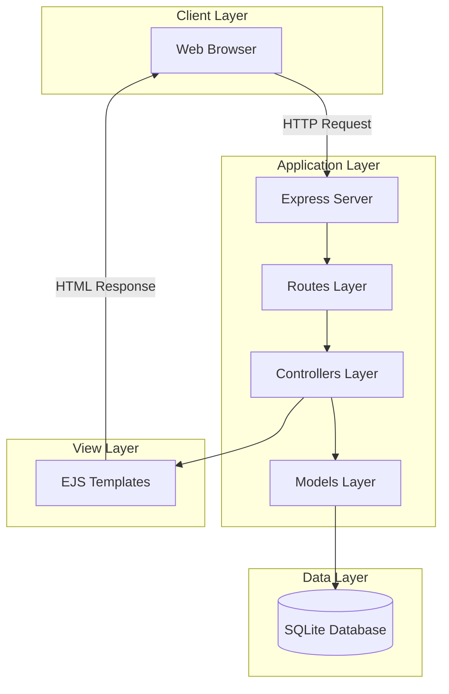

### 2.2 System Context

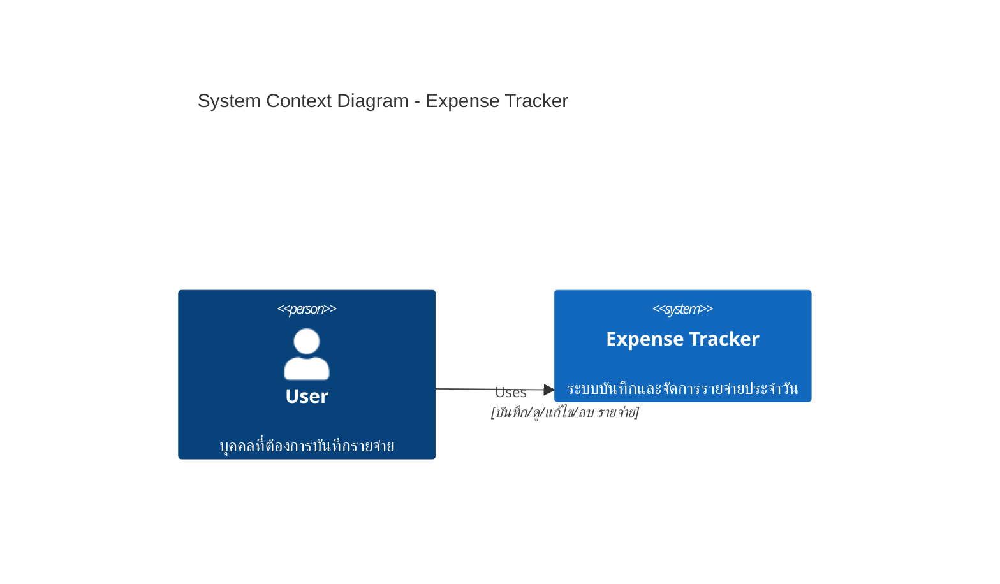

---

## 3. System Architecture

### 3.1 MVC Architecture Pattern

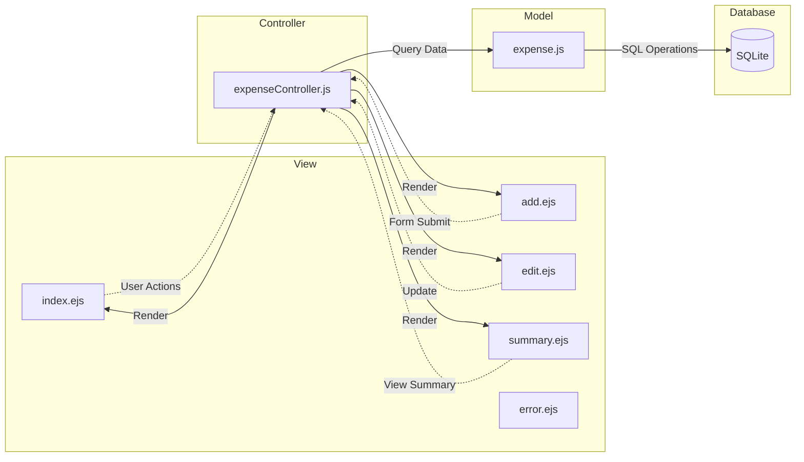

### 3.2 Directory Structure

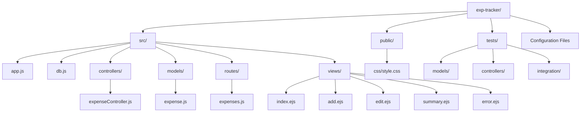

---

## 4. Database Design

### 4.1 Entity Relationship Diagram

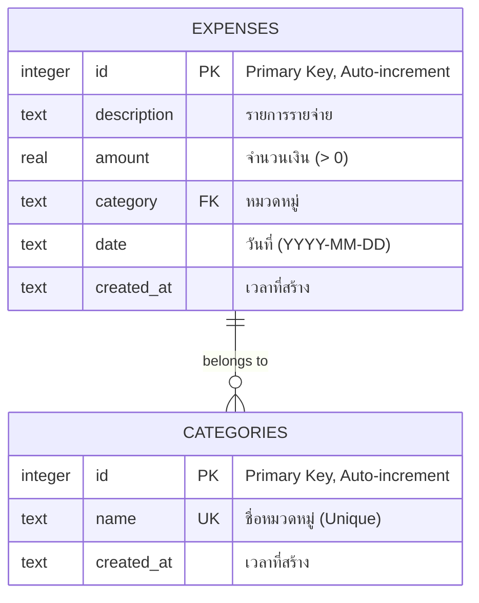

### 4.2 Database Schema

#### Table: `expenses`
| Column      | Type    | Constraints           | Description                    |
|-------------|---------|-----------------------|--------------------------------|
| id          | INTEGER | PRIMARY KEY, AUTOINCREMENT | รหัสรายจ่าย                    |
| description | TEXT    | NOT NULL              | รายละเอียดรายจ่าย              |
| amount      | REAL    | NOT NULL, CHECK(>0)   | จำนวนเงิน                      |
| category    | TEXT    | NOT NULL              | หมวดหมู่                       |
| date        | TEXT    | NOT NULL              | วันที่ (ISO format)            |
| created_at  | TEXT    | DEFAULT NOW           | วันเวลาที่สร้างรายการ          |

**Indexes:**
- `idx_expenses_date` on `date` - เพิ่มความเร็วในการ query ตามวันที่
- `idx_expenses_category` on `category` - เพิ่มความเร็วในการ query ตามหมวดหมู่

#### Table: `categories`
| Column      | Type    | Constraints           | Description                    |
|-------------|---------|-----------------------|--------------------------------|
| id          | INTEGER | PRIMARY KEY, AUTOINCREMENT | รหัสหมวดหมู่                  |
| name        | TEXT    | NOT NULL, UNIQUE      | ชื่อหมวดหมู่                   |
| created_at  | TEXT    | DEFAULT NOW           | วันเวลาที่สร้าง                |

**Default Categories:**
- อาหาร
- ค่าเดินทาง
- ช้อปปิ้ง
- ค่าบ้าน
- ค่าน้ำค่าไฟ
- บันเทิง
- สุขภาพ
- การศึกษา
- อื่นๆ

---

## 5. Component Design

### 5.1 Component Diagram

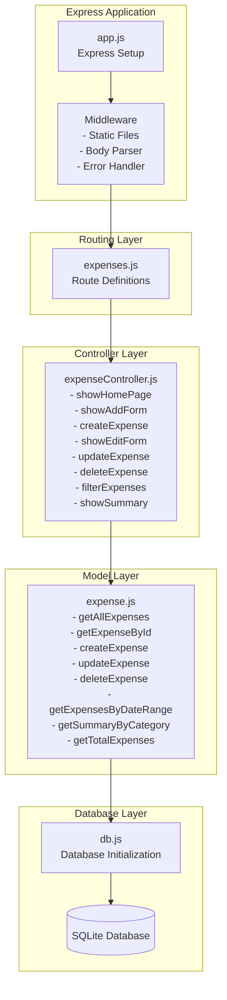

### 5.2 Model Layer - expense.js

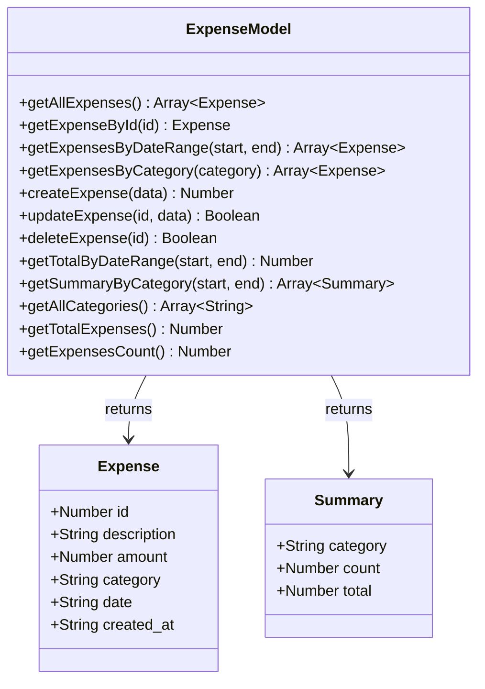

### 5.3 Controller Layer - expenseController.js

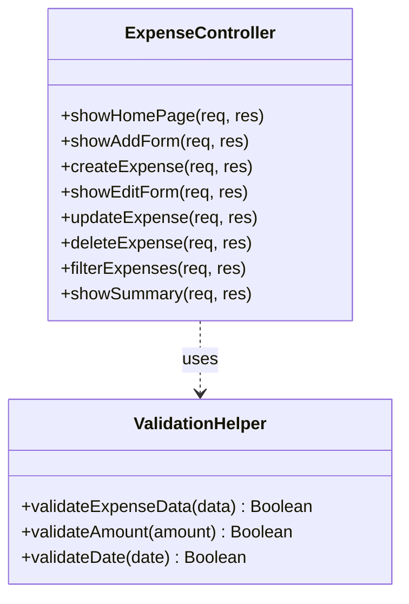

---

## 6. API Design

### 6.1 Route Mapping

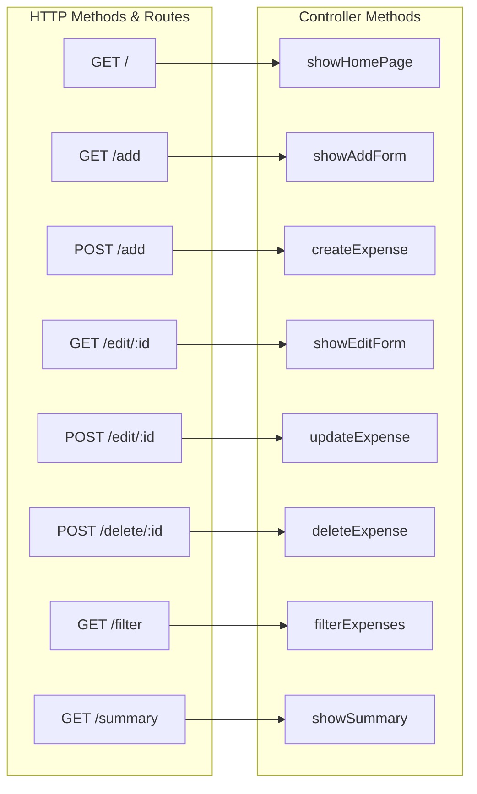

### 6.2 API Endpoints

#### 6.2.1 GET / - Home Page
**Description:** แสดงรายการรายจ่ายทั้งหมด

**Response:** HTML page with expenses list

---

#### 6.2.2 GET /add - Add Expense Form
**Description:** แสดงฟอร์มเพิ่มรายจ่าย

**Response:** HTML form

---

#### 6.2.3 POST /add - Create Expense
**Description:** สร้างรายจ่ายใหม่

**Request Body:**
```javascript
{
  description: String,  // required
  amount: Number,       // required, > 0
  category: String,     // required
  date: String         // required, format: YYYY-MM-DD
}
```

**Response:** Redirect to `/`

**Validation:**
- All fields required
- Amount must be > 0
- Date must be valid format

---

#### 6.2.4 GET /edit/:id - Edit Expense Form
**Description:** แสดงฟอร์มแก้ไขรายจ่าย

**Parameters:**
- `id` - Expense ID

**Response:** HTML form with pre-filled data

**Error:** 404 if expense not found

---

#### 6.2.5 POST /edit/:id - Update Expense
**Description:** อัพเดทรายจ่าย

**Parameters:**
- `id` - Expense ID

**Request Body:** Same as POST /add

**Response:** Redirect to `/`

**Error:** 404 if expense not found

---

#### 6.2.6 POST /delete/:id - Delete Expense
**Description:** ลบรายจ่าย

**Parameters:**
- `id` - Expense ID

**Response:** Redirect to `/`

**Error:** 404 if expense not found

---

#### 6.2.7 GET /filter - Filter Expenses
**Description:** กรองรายจ่ายตามเงื่อนไข

**Query Parameters:**
- `startDate` - Start date (YYYY-MM-DD)
- `endDate` - End date (YYYY-MM-DD)
- `category` - Category name

**Response:** HTML page with filtered expenses

---

#### 6.2.8 GET /summary - Summary Report
**Description:** แสดงสรุปรายงานรายจ่าย

**Query Parameters:**
- `period` - today | week | month
- `startDate` - Custom start date
- `endDate` - Custom end date

**Response:** HTML page with summary by category

---

## 7. Sequence Diagrams

### 7.1 Create Expense Flow

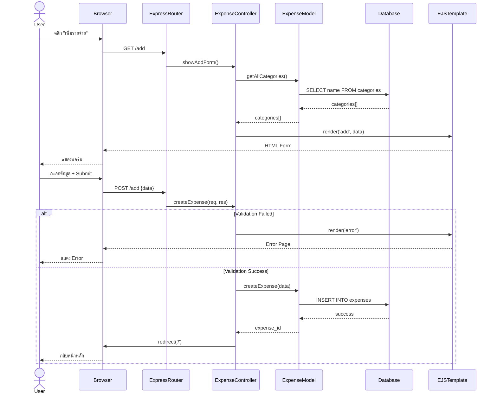

### 7.2 View Expenses with Filter

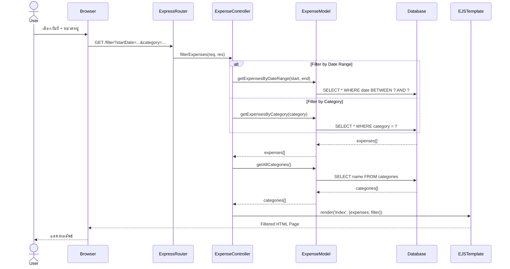

### 7.3 Update Expense Flow

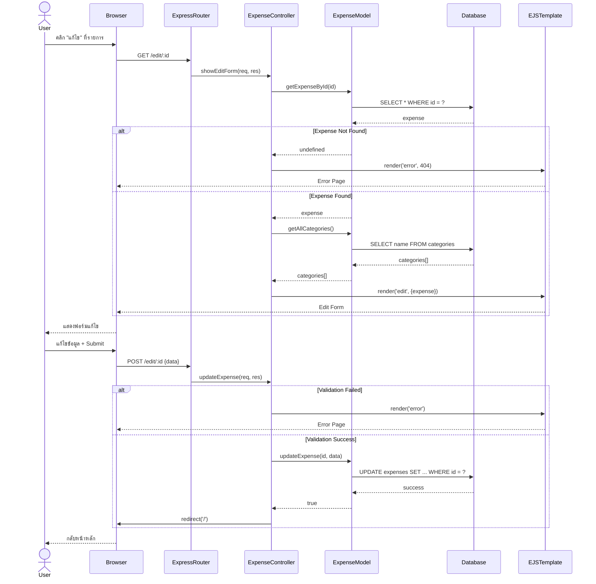

### 7.4 Delete Expense Flow

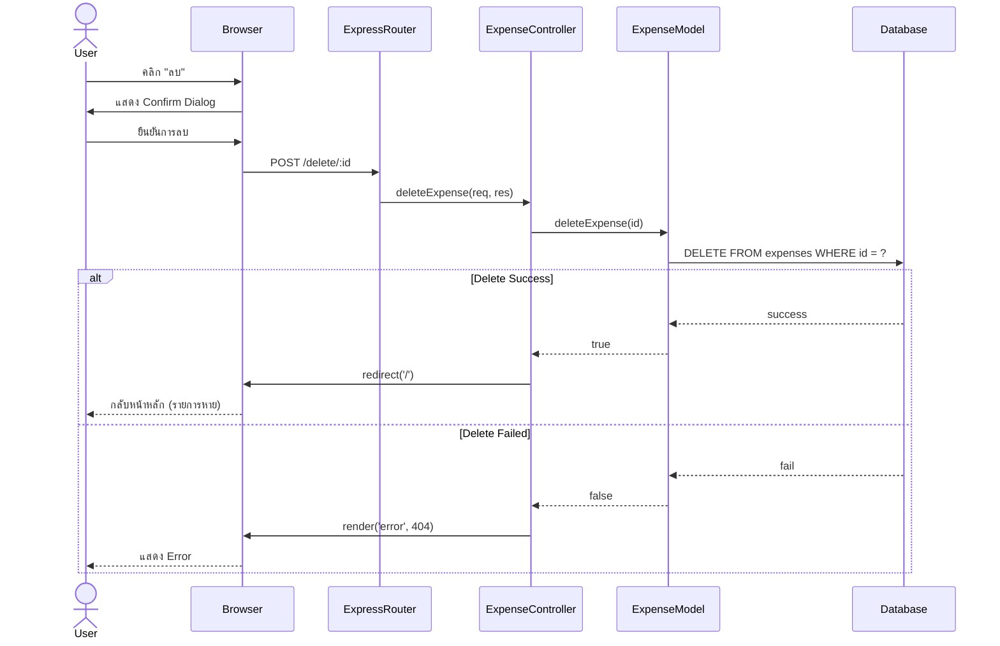

### 7.5 Summary Report Flow

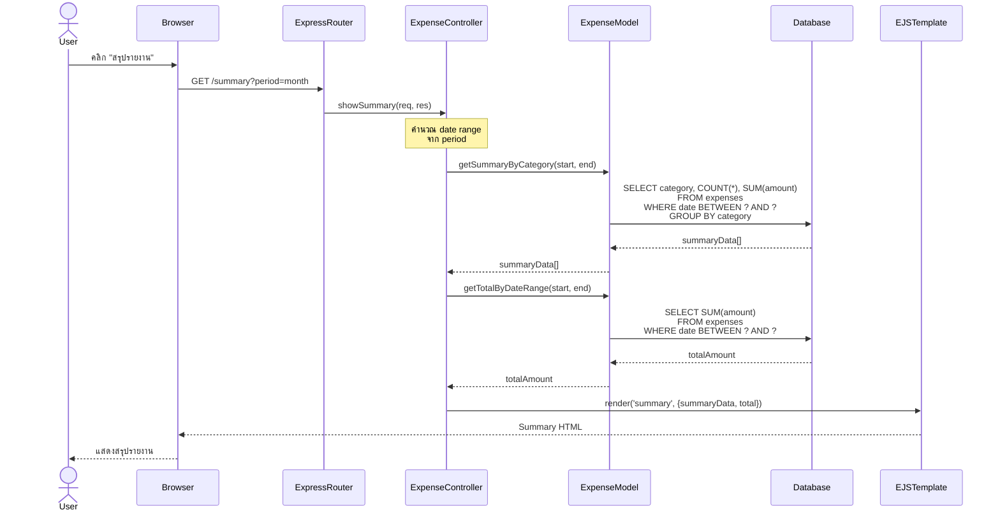

---

## 8. Data Flow

### 8.1 Overall Data Flow

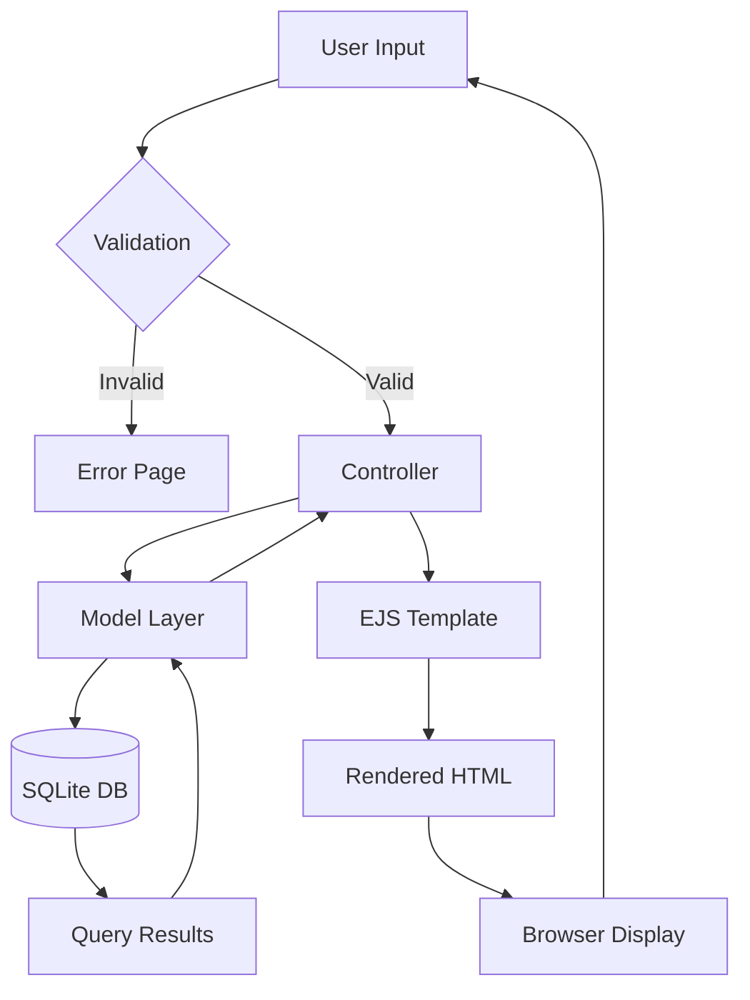

### 8.2 Request/Response Flow

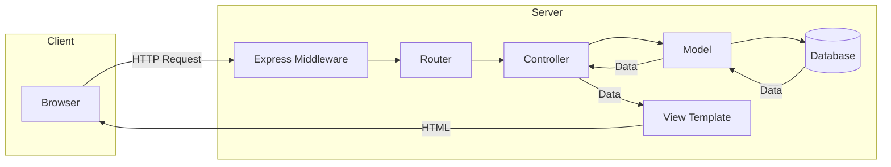

### 8.3 Data Processing Pipeline

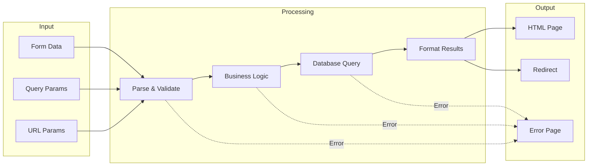

---

## 9. User Interface Design

### 9.1 Page Structure

```mermaid
graph TD
    subgraph Layout
        Header[Header<br/>💰 Expense Tracker]
        Nav[Navigation<br/>รายการรายจ่าย | เพิ่มรายจ่าย | สรุปรายงาน]
        Main[Main Content]
        Footer[Footer]
    end
    
    Header --> Nav
    Nav --> Main
    Main --> Footer
    
    Main --> Page1[Index Page]
    Main --> Page2[Add Page]
    Main --> Page3[Edit Page]
    Main --> Page4[Summary Page]
```

### 9.2 Index Page (Home) Wireframe

```mermaid
graph TB
    subgraph "Index Page Layout"
        Title[รายการรายจ่ายทั้งหมด]
        
        subgraph FilterSection
            F1[วันที่เริ่มต้น]
            F2[วันที่สิ้นสุด]
            F3[หมวดหมู่]
            F4[ปุ่มกรอง]
        end
        
        Summary[ยอดรวม: ฿X,XXX.XX]
        
        subgraph ExpenseTable
            TH[วันที่ | รายการ | หมวดหมู่ | จำนวนเงิน | จัดการ]
            TR1[Row 1 Data + แก้ไข/ลบ]
            TR2[Row 2 Data + แก้ไข/ลบ]
            TR3[...]
        end
    end
    
    Title --> FilterSection
    FilterSection --> Summary
    Summary --> ExpenseTable
```

### 9.3 User Interaction Flow

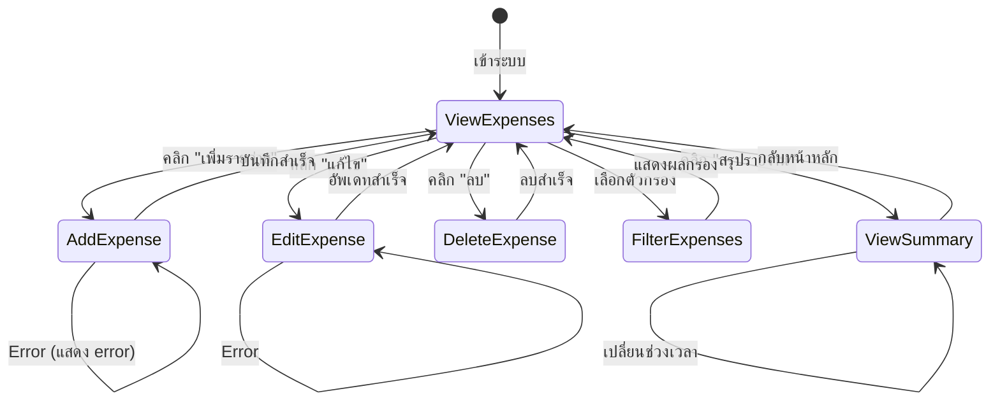

---

## 10. Security Considerations

### 10.1 Security Measures

```mermaid
mindmap
  root((Security))
    Input Validation
      Form Validation
      Data Type Checking
      Amount > 0
      Date Format
      Required Fields
    SQL Injection Prevention
      Prepared Statements
      Parameterized Queries
      better-sqlite3
    XSS Prevention
      EJS Auto-escaping
      HTML Sanitization
    CSRF Protection
      Same-origin
      Single-user app
    Error Handling
      No Sensitive Info Leak
      Generic Error Messages
      Logging
    Data Integrity
      Database Constraints
      CHECK constraints
      NOT NULL constraints
      UNIQUE constraints
```

### 10.2 Validation Flow

```mermaid
flowchart TD
    Start[User Input] --> V1{ข้อมูลครบ?}
    V1 -->|No| E1[Error: กรอกข้อมูลให้ครบ]
    V1 -->|Yes| V2{Amount > 0?}
    V2 -->|No| E2[Error: จำนวนเงินต้องมากกว่า 0]
    V2 -->|Yes| V3{Date valid?}
    V3 -->|No| E3[Error: รูปแบบวันที่ไม่ถูกต้อง]
    V3 -->|Yes| V4{Category exists?}
    V4 -->|No| E4[Error: หมวดหมู่ไม่ถูกต้อง]
    V4 -->|Yes| Process[ประมวลผลข้อมูล]
    
    E1 --> ErrorPage[แสดง Error Page]
    E2 --> ErrorPage
    E3 --> ErrorPage
    E4 --> ErrorPage
    
    Process --> Success[บันทึกลง Database]
    Success --> Redirect[Redirect ไปหน้าหลัก]
```

---

## 11. Performance Considerations

### 11.1 Database Optimization

```mermaid
graph LR
    subgraph "Optimization Strategies"
        A[Indexes on date & category]
        B[Prepared Statements Caching]
        C[Synchronous Operations]
        D[Connection Pooling]
        E[Query Optimization]
    end
    
    subgraph "Benefits"
        F[Fast Queries]
        G[Low Latency]
        H[Efficient Memory Usage]
    end
    
    A --> F
    B --> G
    C --> G
    D --> H
    E --> F
```

### 11.2 Caching Strategy

```mermaid
graph TB
    Request[Request] --> Cache{In Cache?}
    Cache -->|Yes| Return[Return Cached]
    Cache -->|No| DB[Query Database]
    DB --> Store[Store in Cache]
    Store --> Return
    Return --> Response[Response]
```

---

## 12. Testing Strategy

### 12.1 Test Coverage

```mermaid
graph TB
    subgraph "Testing Pyramid"
        E2E[End-to-End Tests<br/>Integration Tests]
        Integration[API Tests<br/>Controller Tests]
        Unit[Model Tests<br/>Utility Tests]
    end
    
    Unit --> Integration
    Integration --> E2E
```

### 12.2 Test Flow

```mermaid
flowchart LR
    subgraph "Unit Tests"
        UT1[Model Tests]
        UT2[Controller Tests]
    end
    
    subgraph "Integration Tests"
        IT1[API Endpoint Tests]
        IT2[Database Tests]
        IT3[Full Flow Tests]
    end
    
    subgraph "Test Results"
        R1[Coverage Report]
        R2[Test Summary]
    end
    
    UT1 --> IT1
    UT2 --> IT1
    IT1 --> IT2
    IT2 --> IT3
    IT3 --> R1
    IT3 --> R2
```

---

## 13. deployment Architecture

### 13.1 Deployment Options

```mermaid
graph TB
    subgraph "Development"
        Dev[Local Machine<br/>npm run dev<br/>Port 3000]
    end
    
    subgraph "Production Options"
        P1[Traditional Server<br/>VPS/Dedicated]
        P2[Container<br/>Docker]
        P3[Platform<br/>Heroku/Railway]
    end
    
    Dev -.-> P1
    Dev -.-> P2
    Dev -.-> P3
    
    P1 --> DB1[(SQLite File)]
    P2 --> DB2[(SQLite File<br/>or External DB)]
    P3 --> DB3[(PostgreSQL<br/>for production)]
```

### 13.2 Deployment Process

```mermaid
sequenceDiagram
    participant Dev as Developer
    participant Git as Git Repository
    participant CI as CI/CD Pipeline
    participant Server as Production Server
    participant App as Application
    
    Dev->>Git: git push
    Git->>CI: Trigger build
    CI->>CI: Run tests
    CI->>CI: Build application
    
    alt Tests Pass
        CI->>Server: Deploy
        Server->>App: Start/Restart app
        App->>Server: Health check ✓
        Server->>Dev: Deployment success
    else Tests Fail
        CI->>Dev: Deployment failed
    end
```

---

## 14. Error Handling

### 14.1 Error Handling Flow

```mermaid
flowchart TD
    Start[Request] --> Process{Processing}
    
    Process -->|Success| Success[Return Success Response]
    Process -->|Error| ErrorType{Error Type?}
    
    ErrorType -->|Validation Error| E1[400 Bad Request]
    ErrorType -->|Not Found| E2[404 Not Found]
    ErrorType -->|Server Error| E3[500 Internal Server Error]
    
    E1 --> Log1[Log Error]
    E2 --> Log2[Log Warning]
    E3 --> Log3[Log Critical Error]
    
    Log1 --> Render1[Render Error Page]
    Log2 --> Render2[Render Error Page]
    Log3 --> Render3[Render Error Page]
    
    Success --> End[Response]
    Render1 --> End
    Render2 --> End
    Render3 --> End
```

---

## 15. Future Enhancements

### 15.1 Potential Features

```mermaid
mindmap
  root((Future Features))
    User Management
      Multi-user Support
      User Authentication
      User Profiles
      Shared Expenses
    Advanced Reports
      Charts & Graphs
      Export to PDF
      Monthly Reports
      Budget Analysis
    Enhanced Features
      Receipt Upload
      Image Storage
      Recurring Expenses
      Budget Alerts
      Multi-currency
    Mobile App
      React Native
      Progressive Web App
      Mobile-optimized UI
    Integrations
      Bank API
      Email Notifications
      Cloud Backup
      Data Sync
```

---

## Appendix

### A. Technology Stack Details

| Layer | Technology | Version | Purpose |
|-------|-----------|---------|---------|
| Runtime | Node.js | 14+ | JavaScript runtime |
| Framework | Express.js | 4.18+ | Web framework |
| Database | SQLite | 3.x | Lightweight database |
| DB Driver | better-sqlite3 | 9.2+ | Synchronous SQLite driver |
| Templating | EJS | 3.1+ | Server-side rendering |
| Testing | Jest | 29.7+ | Testing framework |
| Testing | Supertest | 6.3+ | HTTP assertions |
| Environment | dotenv | 16.3+ | Environment variables |

### B. Coding Standards

- **Style Guide:** JavaScript Standard Style
- **Naming Convention:** camelCase for functions/variables, PascalCase for classes
- **File Organization:** MVC pattern
- **Comments:** JSDoc for functions, inline for complex logic
- **Error Handling:** Try-catch blocks, centralized error handler
- **Database:** Prepared statements only, no string concatenation

### C. Database Queries Reference

```sql
-- Get all expenses ordered by date
SELECT * FROM expenses ORDER BY date DESC, created_at DESC;

-- Get expenses by date range
SELECT * FROM expenses 
WHERE date BETWEEN ? AND ? 
ORDER BY date DESC;

-- Get summary by category
SELECT category, COUNT(*) as count, SUM(amount) as total 
FROM expenses 
WHERE date BETWEEN ? AND ? 
GROUP BY category 
ORDER BY total DESC;

-- Get total expenses
SELECT COALESCE(SUM(amount), 0) as total FROM expenses;
```

---

## Document History

| Version | Date | Author | Changes |
|---------|------|--------|---------|
| 1.0 | 2026-02-06 | Development Team | Initial SDS Document |

---

**End of Software Design Specification**